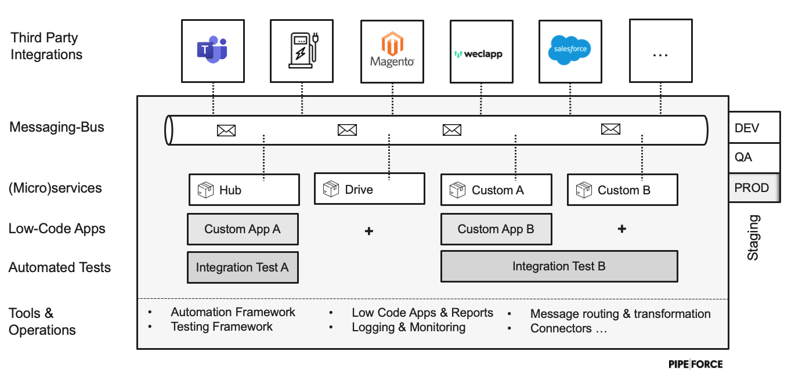

# Getting Started

PIPEFORCE is a process automation and integration platform that is built entirely cloud-native. It runs inside a container orchestration environment like Kubernetes using microservices and messaging. Designed ground-up that way. It covers all aspects to create modern and best-of-breed enterprise solutions. It helps to create, deploy and operate digital services, workflow apps, and data mappings across the entire journey from planning and discussion to implementation, testing and life-cycle management. Everything on a single platform using low-code and custom microservices.

## What is PIPEFORCE for?

PIPEFORCE helps you to:

- document
- integrate
- automate
- train

business workflows within your company. Its an open platform which supports you to

- integrate (connect) different Systems and APIs with simple to use connectors and pipelines
- do data migration, transformation, cleansing and enrichment using data pipelines
- build any business apps using a forms and lists framework
- design, discuss and implement standardized BPMN workflows using an online designer
- automate tasks und flows using the built-in RPA toolings and workflows
- define a clear model for separation of people's responsbilities 
- define a clear development and deployment model 

All of this in a fraction of time.

We at PIPEFORCE believe that the digital success of new age enterprises lies in the ability to scale the development of digital solutions. We think that Low Code / No Code platforms are important here, but they won't solve all aspects. Instead, our goal is to give your employees digital superpower in their fields. We bring the experts closer together, so they can build business solutions to empower their company to cover the challenges of the digital age in a way and speed, that no others can do.

PIPEFORCE helps enterprises to achieve **digital superpower** by clearly separating the responsibilities and defining the interfaces between:

- User
- Admin
- Low Code Developer
- Professional Developer
- DevOp

This documentation is mainly for Low Code and Professional Developers. If you are looking for user or admin manuals, please refer to the [Support pages](https://logabit.atlassian.net/servicedesk/customer/portals).

If you are a Low Code Developer or a Professional Developer and new to PIPEFORCE, we recommend you to walk through the [Tutorials](tutorials/basics) section first. After this you should have a good base understanding of PIPEFORCE.

In the [Guides](guides/command) section you can find deep diving documentation about concepts and technologies, that PIPEFORCE is using.

In the [API](api/commands) section you can find reference documentation for PIPEFORCE.

In case you don't have a PIPEFORCE account yet, we highly recommend you to create one first, so you can try out all examples and tutorials live. It's a matter of seconds to create a free account here:

 **https://try.pipeforce.org**
