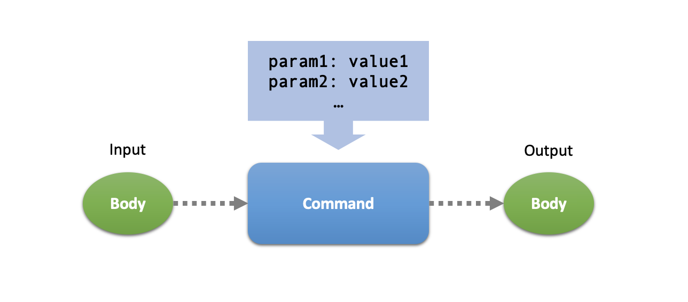
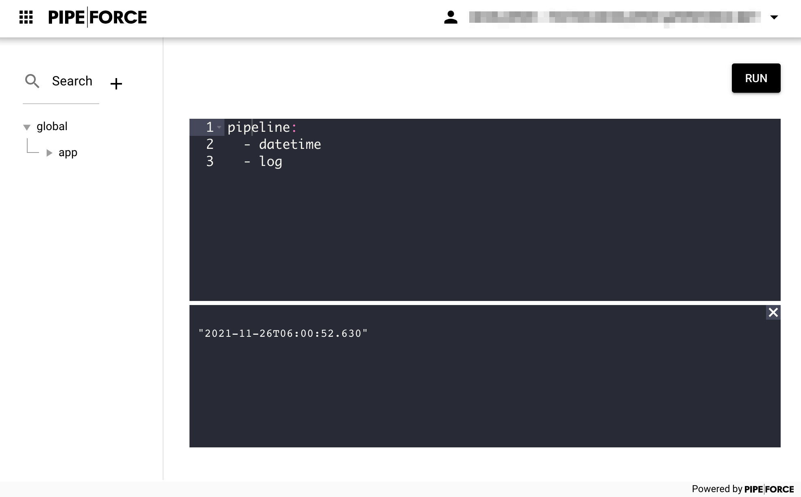

# Command

One of the most important parts in PIPEFORCE is the **command**. Easily spoken, the definition of a command is like this:

:::tip What is a Command?
 A command is server-side component which can be called remotely. It takes an input, does a certain task and finally produces an output.
:::

There are many different commands for different tasks. For example commands to 
- upload and download files
- encrypt and decrypt data 
- save data into a database or read from it 
- connect to other systems and read / write data there

just to name a few examples. You can find a all built-in commands in the [commands reference](../api/commands) or directly try them out in the [trial instance](https://trial.pipeforce.org/#/commands).

The concept of PIPEFORCE commands is in its base a combination of the [command pattern](https://en.wikipedia.org/wiki/Command_pattern) and [function as a service](https://en.wikipedia.org/wiki/Function_as_a_service) approach. 

## Command Name
Each command has a unique name which is always written in lower case and follows the dot notation. Here is an example of such a command name:

```bash
mail.send
```

## Command Parameters
Commands can have zero to many parameters. Whereas each parameter is a name-value pair. The parameters can be passed in different ways to the command, depending on the execution context you're working in. See execution examples below.

## Executing a Command

Commands can be executed in three different ways, called ***execution contexts***:

- As single requests via HTTP GET, POST or PUT
- Embedded as part of a [Pipeline](../guides/pipeline)
- As a command line command using the [Command Line Interface (CLI)](../guids/../api/cli.md)

:::tip Note
Even if many commands do have a similar resource-based semantic for HTTP GET, POST or PUT as REST do, they do not follow this approach 100% since commands can be used also outside of the HTTP context. Therefore, the operation type of a command is often defined by its name. For example: `property.put` or `config.get` to name just a few.
:::

### Execute as HTTP Request
Every command can be excuted by a HTTP request, similar to REST endpoints. The url structure is always like this:

```yaml
https://HOST/api/v3/command/COMMAND?PARAM=VALUE
```
:::tip Note
- Replace ``HOST`` by the host name of your instance.
- Replace ``COMMAND`` by the name of the command.
- Replace ``PARAM`` and ``VALUE`` by the optional parameter of your command.
:::

#### Execute as HTTP GET
Here is an example to execute a command as HTTP GET request and set the `message` parameter to a `log` command using a HTTP GET parameter:

```yaml
http://hub-trial.pipeforce.org/api/v3/command/log?message=HELLO
```
:::tip Note
- Authentication is not considered here for simplicity reasons.
- Replace ``http://hub-trial.pipeforce.org`` by the url of your target system.
:::

#### Execute as HTTP POST
Here is an example to execute a command as HTTP POST request and set the `message` parameter to a `log` command using a HTTP POST data body in `curl`:

```bash
curl -H "Authorization: Bearer <YOUR_TOKEN>" \
  -X POST "https://hub-trial.pipeforce.org/api/v3/command/log" -d "message=HELLO"
```

:::tip Note
- Authentication is done here by using the `Authorization` header. See [Authorization](../api/headers) for details.
- Replace ``http://hub-trial.pipeforce.org`` by the url of your target system.
:::

### Execute as CLI call
Here is an example to execute a command using the [CLI tool](../guides/../api/cli.md) and set the `message` parameter to the `log` command:

```bash
pi command log message=HELLO
```
### Execute in a Pipeline
Commands can be executed as part of a [pipeline](../guides/pipeline). Here is an example of such a pipeline with a single `log` command and the `message` parameter:

```yaml
pipeline:
  - log:
      message: "HELLO"
```

:::tip Note
 - Its also possible to chain multiple commands in a pipeline. Learn more about this in the [Pipelines](../guides/02_pipeline.md) guide.
 - You can try out pipelines using the [online workbench](https://trial.pipeforce.org/#/propertyeditor). 
:::

## Input and Output Body

Beside **parameters** a command can also consume a so called **input body** to read data from and write to an **output body**.



This is similar to an HTTP POST request which also can consume a huge amount of data in the request body and returns with data in the response body.

Differently to parameters, the input body is typically a more complex document and/or bigger data stream which must be modified in some way. Therfore it is passed-in and written-out via the body by default. 

Here is an example to pass data via body to a `cache.put` command using a HTTP POST request and the `curl` tool:

```bash
curl -H "Authorization: Bearer <YOUR_TOKEN>" \
  -X POST "https://hub-trial.pipeforce.org/api/v3/command/cache.put?key=someKey" \
  -d '{"productId": 123, "quantity": 10}'
```

:::tip Note
- Authentication is done here by using the `Authorization` header. See [Authorization](../api/headers.md#authorization) for details.
- Replace ``http://hub-trial.pipeforce.org`` by the url of your target system.
:::

## Chaining of Commands (Pipelining)

One of the most powerful things of commands is that they can be chained, so multiple commands can be executed in serial one after another in a single request. In this case, the output of a previous command becomes automatically the input of the next command.
This avoids server-client-round-trips which can increase performance a lot, adds a huge level of flexibility and reduces complexity in client code.


:::tip Note
  Chainig of commands is also called a **pipeline** or a **pipe**. 
:::

### Send a pipeline via HTTP

To chain commands, you have to send a POST request to the endpoint ``https://HOST/api/v3/pipeline`` and put a YAML document with the chained commands in the body. Lets assume you have a pipeline of commands like this, which simply logs the current data and time:

```yaml
pipeline:
  - datetime
  - log
```

Then, you could send this YAML pipeline to the server for execution like this example using ``curl`` shows:

```bash
curl -H "Authorization: Bearer <YOUR_TOKEN>" \
  -X POST "https://hub-trial.pipeforce.org/api/v3/pipeline" \
  -d @- << EOF
  pipeline:
    - datetime
    - log
  EOF
```

### Send a pipeline in Workbench

In case you are working with the [online workbench](https://trial.pipeforce.org/#/propertyeditor), creating and sending a pipeline could look like this:



:::tip
  To learn more about **Pipelines**, have a look into the  [Pipelines Guide](../guides/pipeline).
:::
