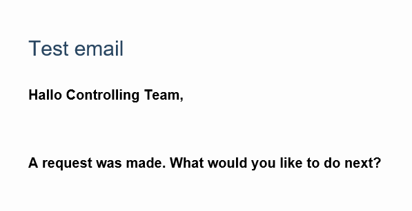
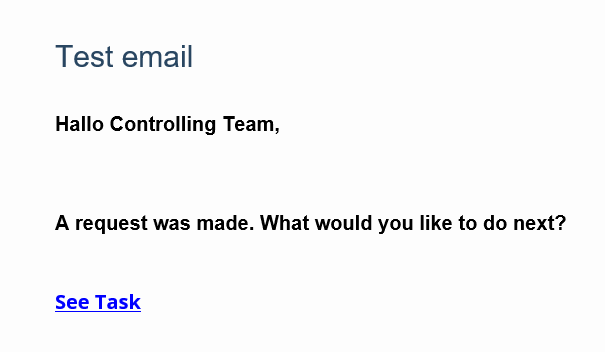

# Email

We can create templates (in html) for emails, and use them in our pipelines. Task Links can also be included into the emails through templates and pipelines.

## 1 - Create an email template

1.  Login to the portal https://**NAMESPACE**.pipeforce.net
    
2.  Navigate to LOW CODE → Workbench
    
3.  Select the node of your app or [create a new one](../tutorials/create-app).
    
4.  Click the plus icon at the top of the tree.
    
5.  The new property view opens:
    
    1.  As property key, use: `global/app/YOUR_APP/template/email`, where you can replace YOUR_APP with your own app name
        
    2.  As mime type, use: `text/plain; type=template; format=freemarker`
        
6.  Click `SAVE`
    
7.  The new property has been created, and the content editor was opened for you.
    
8.  Now copy and paste this content into the editor, and overwrite any existing data there by this:

```html
<div>
  <p>
    <b>Hallo Controlling Team,</b>
  </p>
  <br/>

  <p>
    <b>A request was made. What would you like to do next?</b>
  </p>
</div>
```

9.  Click `SAVE`


## 2 - Create an email pipeline
    
Now, we must create a pipeline where the emails' messages contain the content of this template.

1.  Click the plus icon at the top of the tree.
    
2.  The new property view opens:
    
    1.  As property key, use: `global/app/YOUR_APP/pipeline/myPipeline`, where you can replace YOUR_APP with your own app name
        
    2.  As mime type, use: `application/yaml; type=pipeline`
        
3.  Click `SAVE`
    
4.  The new property has been created, and the content editor was opened for you.
    
5.  Now copy and paste this content into the editor, and overwrite any existing data there by this:

```json
  pipeline:
  - mail.send:
      to: "your@domain.tld"
      subject: "Test email"
      message: "uri:property:global/app/YOUR-APP/template/email"
```

6.  Replace `your@domain.tld` by your real email address.
    
7.  Click `SAVE` and then `RUN` to execute the pipeline.

8.  After a while, you should have received an email like this:

    

Here, we created a simple pipeline where we send email where the message points to the template we created in the same app i.e. `uri:property:global/app/YOUR-APP/template/send-email`. Note that we must put `uri:property:` in the suffix of the template path here.


## 3 - Set a link to a task in an email template

We also have the power to add task links in the emails. For this, we update the above pipeline to this:

```json
pipeline:
  - set.var:
      key: "taskUrl"
      value: "#{@instance.url('portal') + '/#/task'}"
  - mail.send:
      to: "m.shahid@logabit.com"
      subject: "Test email"
      message: "uri:property:global/app/neel100/template/email"
      model: "#{{taskUrl: vars.taskUrl}}"
```

Click `SAVE`. 

Here, we define a variable which holds link to a task called "taskUrl". We pass this variable to the template using the "model" attribute. Now, we must update the previous template to this:

```html
<div>
  <p>
    <b>Hallo Controlling Team,</b>
  </p>
  <br/>

  <p>
    <b>A request was made. What would you like to do next?</b>
  </p>
  <br/>

  <a href="${taskUrl}"><b>See Task</b></a><br/>
</div>
```

Click `SAVE`. 

Here, we used the `taskUrl` variable from the pipeline, so we can get link to the task in the email. 
Now, go back to the pipeline and click `RUN` to execute the pipeline. This will generate an email containing a link like this:

