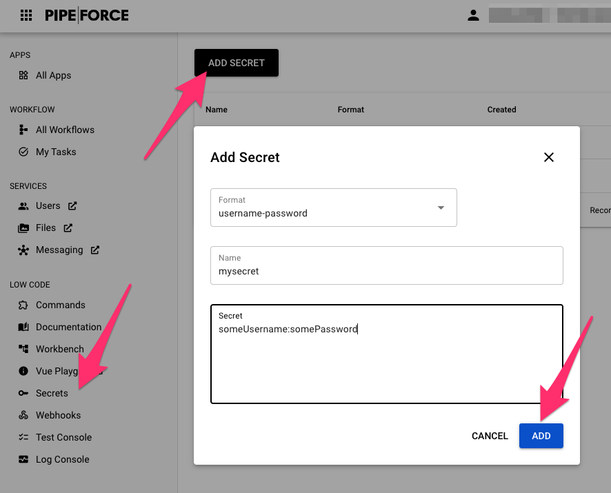

# Secrets

A secret in PIPEFORCE is a piece of information you would like to share between services and systems but must
stay highly confidential as much as possible.

Here are some examples of secrets:
 
 - An API token to access an external service.
 - A set of username and password.
 - A key to encrypt and decrypt some data.

All of these secrets must be handled very carefully. Therefore it is not a good idea to place this kind of information
in the source code of your pipeline scripts or services.

Instead, you should create a secret once in PIPEFORCE and refer to it by its unique name. Only the backend component
who is allowed to work with the secret can then load and use it by this name. Users and other components are not
able to see it.

## Create a secret

In PIPEFORCE you have two options, creating a secret:

 - Using the command [`secret.put`](https://pipeforce.github.io/docs/api/commands#secretput)
 - Using the web interface.

### Format patterns

There are different format patterns of secrets possible:

 - **bearer** - A bearer token typically used in conjunction with JWT. Such a secret is typically placed in the header of an HTTP request. The format pattern for the secret is: `Bearer: <Token>`
 - **header** - A secret with format pattern `<HeaderName>: <HeaderValue>` which will be placed in the header of an HTTP request.
 - **secret-text** - An arbitrary secret text to be used inside of components which are compatible with this format.
 - **username-password** - A set of username and password in the pattern format `<Username>:<Password>`.

### Using a command

In order to create a secret using the command `secret.put`, you can do so for example in the workbench:

```
pipeline:
  - secret.put:
      name: mysecret
      format: username-pasword
      secret: someUsername:somePassword
```

Make sure, you use the corresponding format pattern as described above in your secret value.

### Using the web interface

In order to create a secret using the web interface: After login select `Secrets` in the left menu.

Then click on `Add Secret`, select the format of your secret, give it a unique name, set the secret and click `Add`.



## Using a secret in your pipeline

Once a secret has been created, you can refer to it using its unqiue name inside a pipeline.

It depends on the command whether it supports secrets and in which form. Read the documentation of the command of interest.

Here is an example to refer to the mysecret secret in an HTTP call:

```yaml
pipeline:
  - http.get:
      url: https://hostname
      credentials: mysecret
```