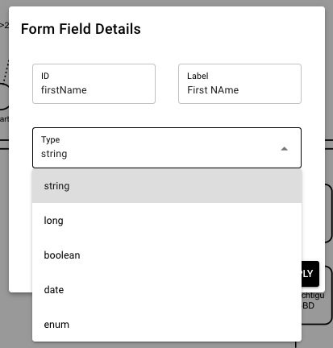

# Form Fields v1

## Form fields for trigger forms

Form fields of a Trigger-Forms are determined by the respective schema defined for your app. The type inside a JSON schema defines the data format of a field. Furthermore based on this type, form fields are rendered automatically in order to fit the defined format. The supported format types are listed in the section [Schema - Types](https://pipeforce.github.io/docs/guides/schema-types) .

To create a trigger form you have to create a schema and afterwards create the form as a new property. How to do this is described here: [Tutorial: Create a new form](https://pipeforce.github.io/docs/tutorials/beginner/create-form) . In the form you can just refer to your schema. All fields and types (including file upload functionality) will be taken over from the schema. See example of form description below:

```json
{
  "title": "person",
  "description": "",
  "schema": "property.list?filter=global/app/MY_App/object/person/v1/schema",
  "output": "global/app/MY_APP/object/person/v1/instance/%23%7Bvar.property.uuid%7D"
}
```

## Form fields for task forms

When working with task forms via the Online-Workflow-Modeler you can select the form type directly from a dropdown list. In this list there are the same options as for schema.



## Static drop down values for form fields

In case you want to show in a field of a trigger form a dropdown list you have the following options:

1.  Refer to a fix list with any values
    
2.  Refer to a group of users from IAM
    

### Fix list of entries

To refer to a fix list of entries, you have to define enum in schema. Below you find an easy example for this.

```yaml
"account": {
      "title": "Kostenstelle *",
      "type": "string",
      "enum": [
        "1000",
        "2000",
        "3000",
        "4000",
        "5000"
      ]
    }
```

If you refer in the form section to this field “account”, you will see a dropdown list of the values entered (1000, 2000, 3000, 4000, 5000).

### Group of users in IAM

to refer to a group of user in IAM, you have to adapt your schema and your form definition.

In your schema you have to define the respective filed as indicated below.

**In schema:**

```yaml
"user": {
      "type": "string",
      "title": "User",
      "enum": []
    }
```

Afterwards you have to enhance your form definition by an specification for the field an a easy pipeline definition, which gives you some values back from IAM. In the example below, all user from group “Employee (Standard)” will be shown in the dropdown list.

**In form:**

```json
{
  "field": "user",
  "visibleColumns": [
    "username"
  ],
  "values": "pipeline:iam.group.members?name=Employee (Standard)"
}
```

## Dynamic drop down values for form fields

In case you want to filter values in a dropdown list based on specific entries in the form you have to enhance your schema and your form definition.

**Example**

When a specific value for budget is exceeded, the list of potential reviewer is directly filtered to members of a specific group in IAM.

|     |     |
| --- | --- |
| **Can sign > 10k** | **Can sign <10k** |
| All members of group “C-Level” | All members of group “Department Head” |

**In schema:**

```yaml
"user": {
  "type": "string",
  "title": "User",
  "enum": []
},
"canSign": {
  "type": "number",
  "title": "Can sign"
}
```

**In form definition:**

```json
{
  "title": "f1",
  "description": "",
  "schema": "property.list?filter=global/app/a1/object/f1/v1/schema",
  "output": "global/app/a1/object/f1/v1/instance/%23%7Bvar.property.uuid%7D",
  "script": {
    "onblur": "var response; if (form.canSign > 10000) { response = await pi.pipeline('iam.group.members?name=C-Level') } else { response = await pi.pipeline('iam.group.members?name=Department Head') }; if (response) { schema.properties.user.enum = response }"
  },
  "layout": {
    "orientation": "vertical",
    "items": [
      {
        "field": "user",
        "visibleColumns": [
          "username"
        ]
      },
      {
        "field": "canSign"
      }
    ]
  }
}
```

## Dynamic calculation of values in a form

You have the option to show calculated values in a trigger form. To do so you have to enhance the schema and the form definition. Below you will find an example how to show a sum of two entries (value1 and value 2) in a third filed.

**In schema:**

```yaml
"value1": {
  "type": "number",
  "title": "value1"
},
"value2": {
  "type": "number",
  "title": "value2"
},
"value3": {
  "type": "number",
  "title": "value3"
}
```

**In form definition:**

```json
{
  "title": "f1",
  "description": "",
  "schema": "property.list?filter=global/app/a1/object/f1/v1/schema",
  "output": "global/app/a1/object/f1/v1/instance/%23%7Bvar.property.uuid%7D",
  "script": {
    "onblur": "form.value3 = form.value1 + form.value2"
  },
  "layout": {
    "orientation": "vertical",
    "items": [
      {
        "field": "value1"
      },
      {
        "field": "value2"
      },
      {
        "field": "value3",
        "readonly": true
      }
    ]
  }
}
```

## Add attachments in a task form

You have the option to upload a file with a task form. To do so you have to enhance your schema and your form definition. Below you will find an example.

**In schema:**

```yaml
"myFile": {
  "type": "object",
  "properties": {
    "filename": 
      {"type": "string"},
    "contentLength": 
      {"type": "number"},
    "contentType": 
      {"type": "string"},
    "contentEncoding": 
      {"type": "string"},
    "content": 
      {"type": "string"}
  }  
}
```

**In form:**

```yaml
"layout": {    
        "orientation": "vertical",
        "items": 
       [
          {
            "field": "myFile",
            "height": "628",
            "render": "pdfviewer",
            "validation": [
              {
                "type": "js",
                "rule": "!!val",
                "message": "Field is required"
        }
      ]
    }
  ]
}
```

Tip: Be aware that you have to configure a layout for your form in order to show the file picker as expected.

## Show attachments in a task form

This functionality will be available with PIPEFORCE Version 8.0. Documentation will be added after release.
