# Reporting

PIPEFORCE comes with powerful reporting capabilities. 

Such reports can be used to give your users simple insights into your workflow data.

Similar to the forms framework, reports can be created using the low code section in the online workbench.

In order to build reports, it is important that you're familiar with the concepts of [Pipelines](../../guides/commands_pipelines) and [Commands](../../guides/commands_pipeline). If not, please follow the links to read more about these concepts and then come back to this guide.

Each report always consists of two main components:

- **One or more pipelines**, providing the reporting data.
- **A chart** in order to visualize the reporting data.

## Available Charts

To visualize the data of a report, PIPEFORCE uses the library [Chart.js](https://www.chartjs.org/). This library provides many different types of charts. You can find many live examples on the Chart.js website: https://www.chartjs.org/docs/latest/samples .

Here are some example charts which can be used inside PIPEFORCE:

### Vertical Bar Chart

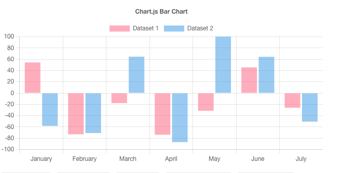

### Horizontal Bar Chart

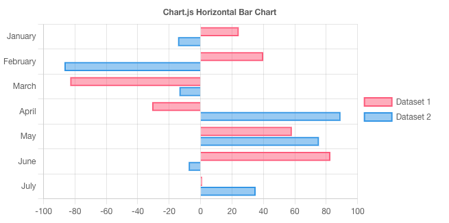

### Stacked Bar Chart

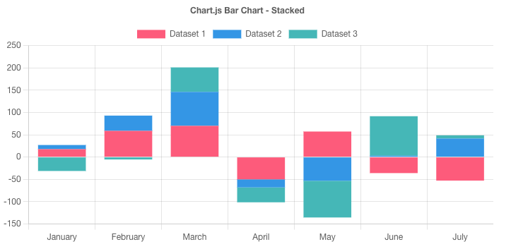

### Line Chart

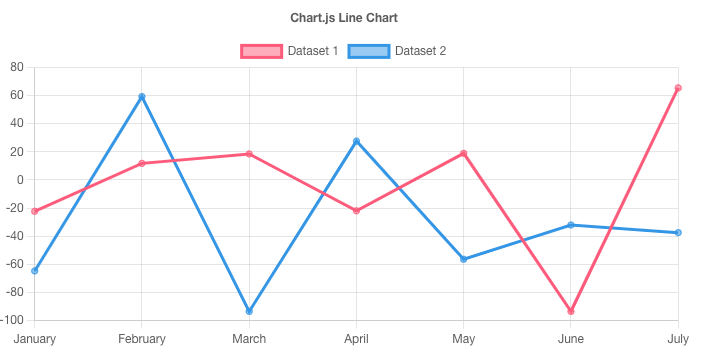

### Line Chart (interpolating)

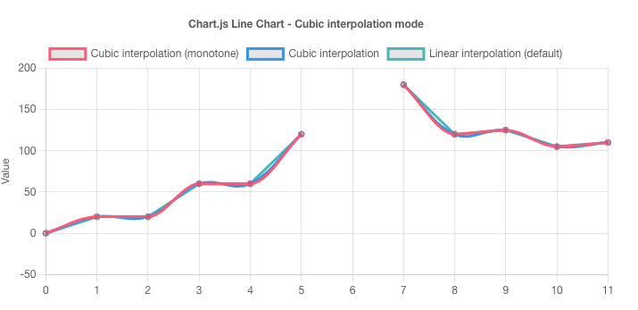

### Bubble Chart

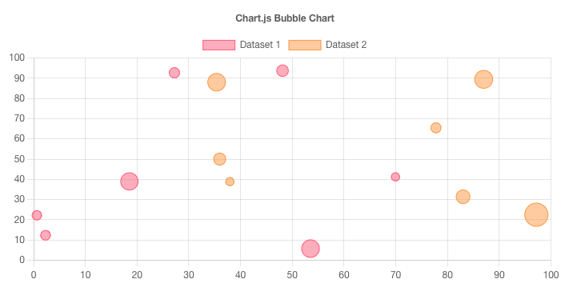

### Doughnut Chart

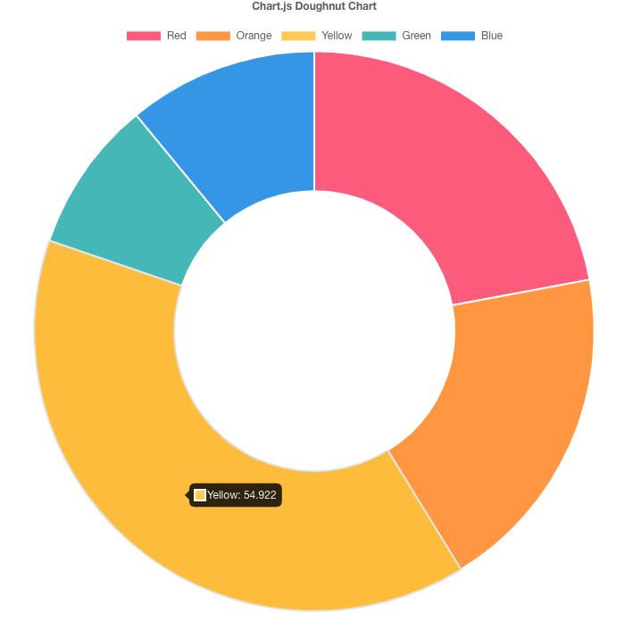

### Pie Chart

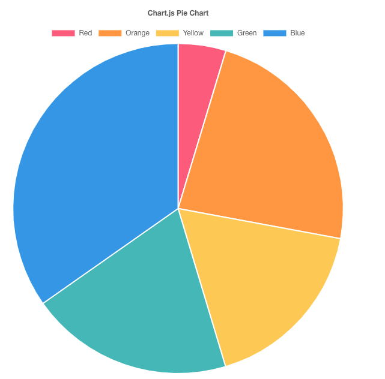

### Polar Chart

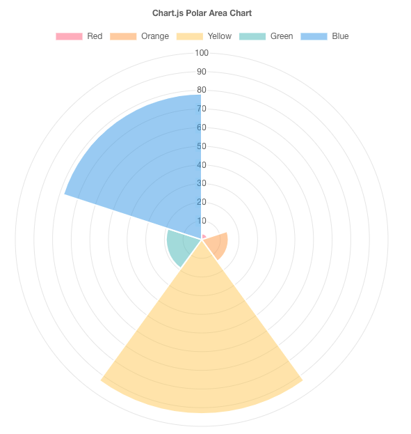

### Radar Chart

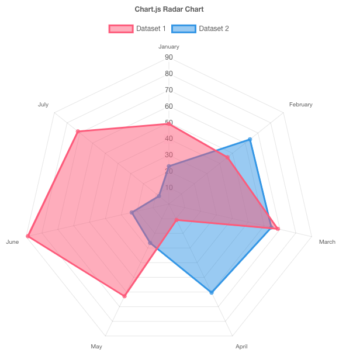

## Creating a static chart

Each app can have multiple reports, each report is visualized by one chart. In order to create such a report chart, you have to create a new property of mime type ``application/json`` inside this path:

```
global/app/myapp/report/myreport
```

Replace ``myapp`` by the name of the app you would like to place the report within and ``myreport`` by the name of your report.

The report configuration has this main format:

```json
{  
  "title": "The title of your report",
  "description": "Description of your report",
  "type": "CHART_TYPE",
  "data" : {...},
  "options": {...}
}
```

Except ``title`` and ``description``, this configuration is a 100% Chart.js configuration file meaning, you can use the full power of this library here. See [here for a full reference about the configuration](https://www.chartjs.org/docs/latest/configuration/) options.

The main sections are:

 - ``title`` - Is the title to be displayed for the report.
 - ``description`` - Is the description of the report.
 - ``type`` - The type of the chart to be displayed. Please refer to the Chart.js [sample documentation](https://www.chartjs.org/docs/latest/samples) and select the key of the chart you would like to display and replace ``CHART_TYPE`` by this key. Example keys are: ``line``, ``bar``, ``radar``, ``doughnut``, ``bubble`` and many more.
 - ``data`` - Defines the data to be consumed by this chart. How this data structure looks like depends on the selected chart. Refer to the Chart.js documentation for the selected chart about it.
 - ``options`` - This section defines configuration options for the selected chart.

There are also other configuration elements possible. Please have a look into the Chart.js documentation for a full reference.

Here is a full working chart configuration with static data:

```json
{
  "title": "Pie chart example",
  "description": "My first PIPEFORCE report",
  "type": "pie",
  "data":  {
    "labels": ["Red", "Orange", "Yellow", "Green", "Blue"],
    "datasets": [
      {
        "data": [20, 40, 20, 10, 10],
        "backgroundColor": ["#4dc9f6", "#f67019", "#f53794", "#537bc4", "#acc236"]
      }
    ]
  },
  "options": {
    "responsive": true,
    "plugins": {
      "legend": {
        "position": "top"
      },
      "title": {
        "display": true,
        "text": "Pie Chart"
      }
    }
  }
}
```

Create a new property using the property editor, for example under ``global/app/myapp/report/piechart``:

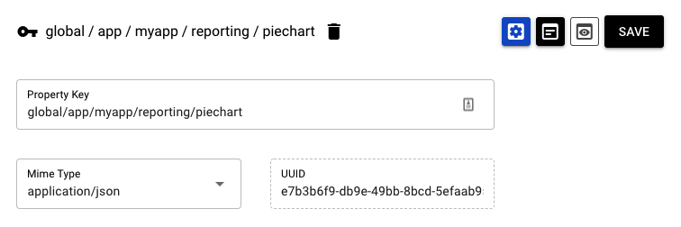

Copy the configuration from above as content to this property and save it. Then go to ``All Apps -> myapp -> Pie chart example``. You should then see a static chart example which looks similar to this:

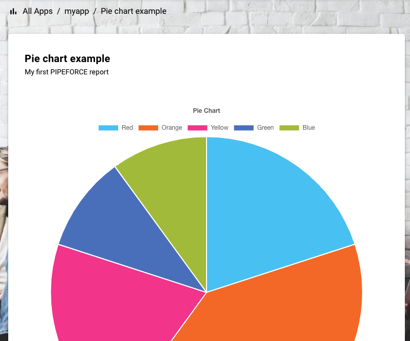

## Creating a dynamic chart

In the previous chapter you have seen how to create a chart with static data. In this section you will learn how to make this report dynamic by loading dynamic data coming from a pipeline.

Its important to understand the concept, that all dynamic data for a chart is provided by a pipeline. Therefore, lets first create a simple pipeline which returns the data section for the chart:

```yaml
pipeline:
  - set.body:
      value: [20, 40, 20, 10, 10]
```

As you can see, this pipeline simply returns the data part of the chart configuration also as static array. But since you're already familiar with the concept of commands and pipelines you can probably imagine the power of this: You can now call any propriate command in order to load data from somewhere, for example from a SQL database, from a REST endpoint or any other data source, convert it into the data structure required by your chart and return it finally in the body.

Lets save this pipeline under the app path you have stored the reporting configuration before, for example: ``global/app/myapp/pipeline/piechartdata``:


The last step is to link your chart configuration with your pipeline. To do so, replace your origin data section of your chart configuration:

```json {5}
  "data":  {
    "labels": ["Red", "Orange", "Yellow", "Green", "Blue"],
    "datasets": [
      {
        "data": [20, 40, 20, 10, 10],
        "backgroundColor": ["#4dc9f6", "#f67019", "#f53794", "#537bc4", "#acc236"]
      }
    ]
  },
```
by this new section:
```json {5}
  "data":  {
    "labels": ["Red", "Orange", "Yellow", "Green", "Blue"],
    "datasets": [
      {
        "data": "$uri:pipeline:pipeline.start?key=global/app/myapp/pipeline/piechartdata",
        "backgroundColor": ["#4dc9f6", "#f67019", "#f53794", "#537bc4", "#acc236"]
      }
    ]
  },
```
As you can see, the static array ``[20, 40, 20, 10, 10]`` was replaced by a string, pointing to your pipeline: ``$uri:pipeline:pipeline.start?key=global/app/myapp/pipeline/piechartdata``.

The next time you reload your chart, it will load the data now from the pipeline.

This approach can also be used for the ``labels`` element to provide dynamic labels.

## Caching report data

Sometimes collecting and preparing the data for a report can be a long running task which takes a lot of time and processing power. In this situations you should consider to cache your reporting data. 

To do so, you can use the pipeline commands [``cache.get``](../../api/commands.md#cacheget) and [``cache.put``](../../api/commands.md#cacheput). Let's see the pipeline from the previous chapters extended by these caching commands:


```yaml
pipeline:

  - cache.get:
      key: "report:piechart"
      exit: true

  - set.body:
      value: [20, 40, 20, 10, 10]

  - cache.put:
      timeToLive: 30
      key: "report:piechart"
      value: "#{body}"

```

As you can see, the command [``cache.get``](../../api/commands.md#cacheget) at the beginning of the pipeline first looks-up an entry in the cache under key ``report:piechart``. In case such an entry exists, the pipeline will be exited. 

Otherwise the pipeline will be executed, the report data generated and stored in the body.

Finally this data from the body will be put into the cache using the key ``report:piechart``. The data will be kept for ``30`` minutes.

In case this pipeline wil be run within the next 30 minutes, the data is returned from the cache.
