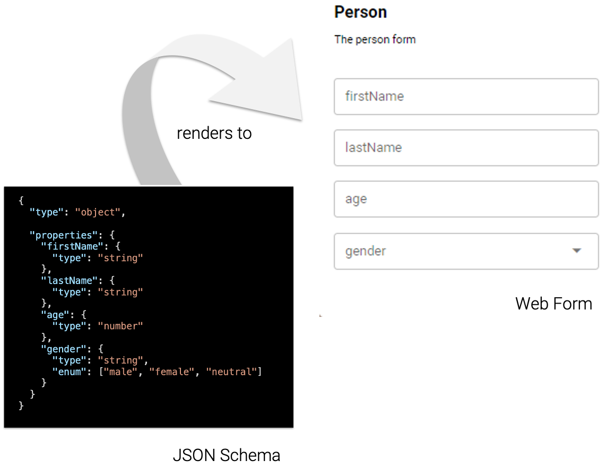

# Schema & Objects

Objects in PIPEFORCE are custom models that represent data of a specific app or process. For example an `Invoice` or `Person` object. The structure of such objects can by defined using a Schema. Also forms need such a Schema for its field structure.

# The Schema

For example before you can use a form, you need to know which “type of data” such a form produces: After a form was submitted, it creates a new data set called an **object and stores it into the property store**. The structure of such an object (which fields it has) is defined in a JSON Schema.

**JSON Schema** is a formalized format to describe data structures in the JSON document format. It is similar to XML Schema, DTD or Database Schemas, but a lot easier.

See here for more details about JSON schema: [https://json-schema.org/](https://json-schema.org/)

PIPEFORCE Forms are built on top of JSON schema. Therefore, the first step to create a form is always to create a JSON schema configuration or using an existing one.

But also in other areas beside forms it is meaningful to define a JSON Schema first before you start to work with data models in your application.

Here is an example of how such a JSON schema can look like defining an person object:

```
{
  "type": "object",

  "properties": {
    "firstName": {
      "type": "string"
    },
    "lastName": {
      "type": "string"
    },
    "age": {
      "type": "number"
    },
    "gender": {
      "type": "string",
      "enum": ["male", "female", "neutral"]
    }
  }
}
```

You can see that it defines four fields of different types: The `firstName`, `lastName`, `age` and `gender` of a person. Within your application you can then refer to it at any place as the model with a clearly defined structure.

By default, a JSON schema which describes an object within PIPEORCE is placed in a property using this key path:

```
global/app/<APP>/object/<NAME>/v1/schema
```

Whereas `<APP>` is the name of the app, the object belongs to and `<NAME>` is the name of the object. In the example of a person which is part of the app `myApp`, you could use this path to access the object schema in a unique way from within the overall PIPEFORCE instance:

```
global/app/myApp/object/person/v1/schema
```

## Default form rendering

The JSON schema will be used as a base to render the fields defined in it as a form. By default all fields are rendered vertically (each in a row) as you can see here:


