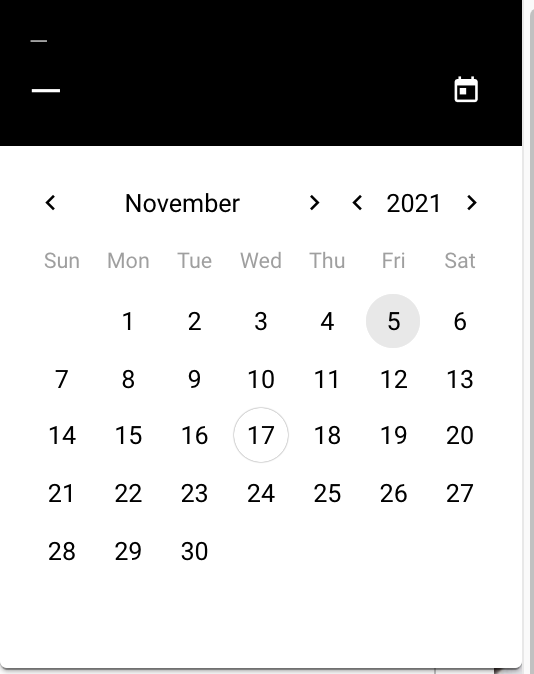
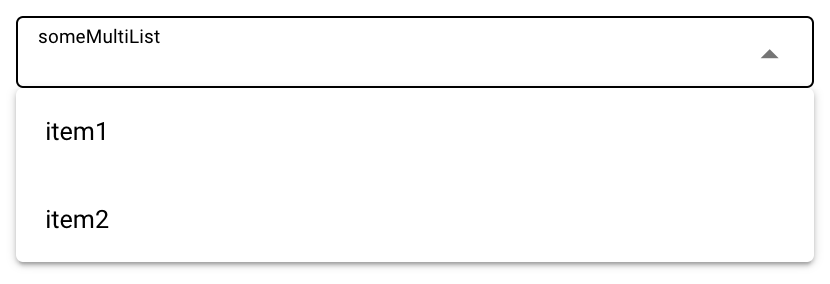
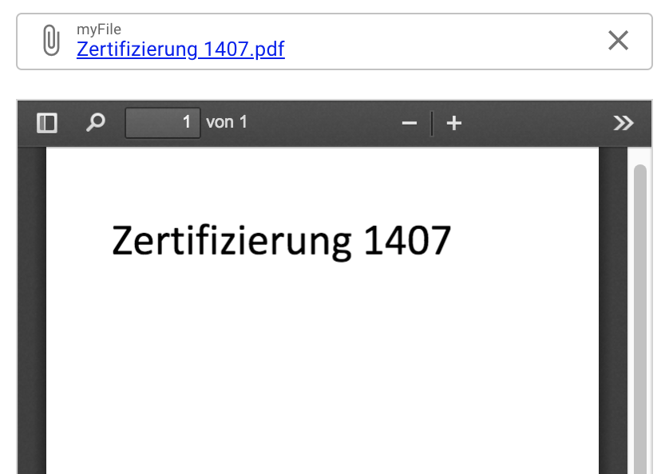

# Schema & Objects

Objects in PIPEFORCE are custom models that represent data of a specific app or process. For example an `Invoice` or `Person` object. The structure of such objects can by defined using a Schema. Also forms need such a Schema for its field structure.

For example before you can use a form, you need to know which “type of data” such a form produces: After a form was submitted, it creates a new data set called an **object** and stores it into the property store. The structure of such an object (which fields it has) is defined in a JSON Schema.

**JSON Schema** is a formalized format to describe data structures in the JSON document format. It is similar to XML Schema, DTD or Database Schemas.

See here for more details about the JSON schema specification: [https://json-schema.org/](https://json-schema.org/)

PIPEFORCE Forms are built on top of JSON schema. Therefore, the first step to create a form is always to create a JSON schema configuration or using an existing one.

:::caution
Do not mix-up a schema with a form configuration. There is a clear separation of responsibilities of these two files:

- Schema = Defines the data structure of an object.
- Form Configuration = Defines a form to show the data structure of an object as (editable) form fields.
:::

But also in other areas beside forms it is meaningful to define a JSON Schema first before you start to work with data models in your application.

Here is an example of how such a JSON schema can look like defining an person object:

```json
{
  "type": "object",

  "properties": {
    "firstName": {
      "type": "string"
    },
    "lastName": {
      "type": "string"
    },
    "age": {
      "type": "number"
    },
    "gender": {
      "type": "string",
      "enum": ["male", "female", "neutral"]
    }
  }
}
```

You can see that it defines four fields of different types: The `firstName`, `lastName`, `age` and `gender` of a person. Within your application you can then refer to it at any place as the model with a clearly defined structure.

By default, a JSON schema which describes an object within PIPEORCE is placed in a property using this key path:

```bash
global/app/<APP>/object/<NAME>/v1/schema
```

Whereas `<APP>` is the name of the app, the object belongs to and `<NAME>` is the name of the object. In the example of a person which is part of the app `myApp`, you could use this path to access the object schema in a unique way from within the overall PIPEFORCE instance:

```bash
global/app/myApp/object/person/v1/schema
```

## Schema Types

The ``type`` attribute inside a JSON schema defines the data type of an element.  


:::info 
Based on the basic type set in the schema, the form engine tries to guess a default form field automatically for you. 
You can overwrite this behaviour and set additional configurations for form fields or other form fields in the form configuration.
:::

:::caution
In order to have a clear separation between data structure and form layout, make sure that all layout specific settings go into the form configuration.
:::

Here is an example how a JSON schema is rendered to a default form:


If such a default rendering is not sufficient for you, you can adjust the form layout it in the form configuration.

### Date

```json
"myDate": 
  {
    "type": "string",  
    "format": "date"
  }
```

By default, shows-up as date picker in the form.

   

### Text

```yaml
"myText": 
  {
    "type": "string"
  }
```
Meant for small amount of text. 
By default, renders to a single-line input field in the associated form.
 
 

### List

```json
"mySingleList": 
  {
    "type": "string",
    "enum":["male", "female"]
  }
```

Meant for lists where only one element can be selected from.  
By default, renders to a single-select drop-down in the associatedform.

 

### Multi-List

```json
"someMultiList": 
  {
    "type": "array",
    "items": {
      "type": "string",
      "enum": ["item1", "item2"]
    }
  }
```

Meant for lists where multiple elements can be selected from.  
By default, renders to a multi-select drop-down in the form.



### Yes/No

```json
"myYesNo": {
  "type": "boolean"
}
```  

Meant for yes/no (true/false) values.  
By default renders to a checkbox in the form.  

:::tip
You can overwrite the default layout and set the attribute `"render":"button"` in the form config in order to display this as a clickable button instead of a checkbox.
:::


### Number

```json
"myNumber": {
  "type": "number"
}
``` 
Meant for number values.  
By default, renders to a number field in the form.

   

### File

```json
"myFile": {
  "type": "object",
  "properties": {
    "filename": {
      "type": "string"
    },
    "contentLength": {
      "type": "number"
    },
    "contentType": {
      "type": "string"
    },
    "contentEncoding": {
      "type": "string"
    },
    "content": {
      "type": "string"
    }  
  }
}
```

Meant for file attachments to an object.  
By default, renders to a file picker in the form.

:::tip
You can change the default render type by using one of `"render":"filepicker"` or `"render":"pdfpreview"` in the form configuration.
:::

               

## Schema Validation Rules


### Length

```json
{
  "type": "string",
  "minLength": 2,
  "maxLength": 3
}
```

Valid: `hi`

### Regular expression

```json
{
   "type": "string",
   "pattern": "^(\\([0-9]{3}\\))?[0-9]{3}-[0-9]{4}$"
}
```

Valid: `555-1212`

### Date and Time

```json
{
   "type": "string",
   "format": "date-time"
}
```

Valid: `2018-11-13T20:20:39+00:00`

### Time (draft)

```json
{
   "type": "string",
   "format": "time"
}
```

Valid: `20:20:39+00:00`

### Date (draft)

```json
{
   "type": "string",
   "format": "date"
}
```

Valid: `2018-11-13`

### Email

```json
{
   "type": "string",
   "format": "email"
}
```

Valid: `my@email.de`

### Hostname

```json
{
   "type": "string",
   "format": "hostname"
}
```

Valid: `google.com`

### Uri

```json
{
   "type": "string",
   "format": "uri"
}
```

Valid: `https://google.com`

### Required fields

```json
{
  "type": "object",
  "properties": {
    "name":      { "type": "string" },
    "email":     { "type": "string" },
    "address":   { "type": "string" },
    "telephone": { "type": "string" }
  },
  "required": ["name", "email"]
}
```
