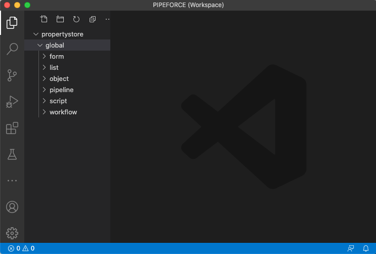
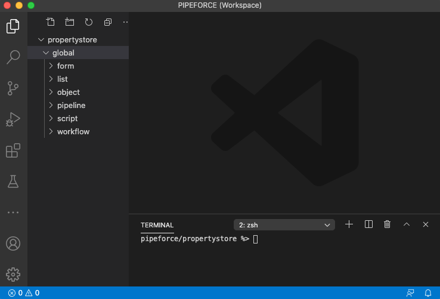
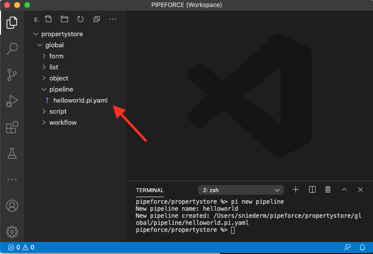
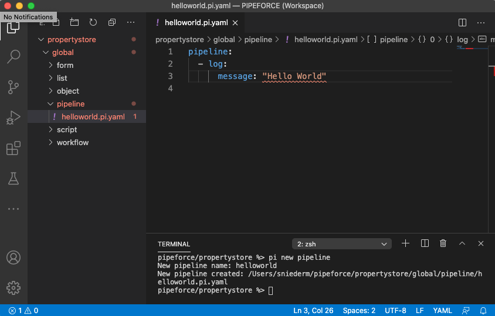
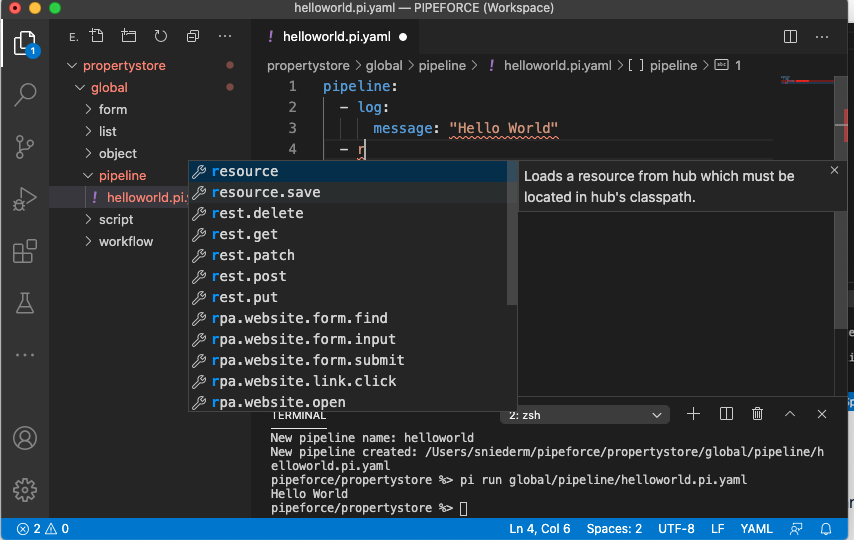

# Visual Studio Code

Visual Studio Code (in short: VS Code) is a free resource editor which works nicely together with the pi tool and simplifies customizing PIPEFORCE. You can also use a different editor but we recommend to use this one at least for the starting phase.

# Download and Installation

You can download Visual Studio Code for free here: [https://code.visualstudio.com/download](https://code.visualstudio.com/download)

# Loading the workspace in VS Code

After you have created a new PIPEFORCE customization workspace, navigate to its location which looks similar to this (could differ depending on your operating system):

```
cd /Users/USERNAME/pipeforce/propertystore
```

Inside this folder there is a file called `PIPEFORCE.code-workspace`. Double click this file in order to start Visual Studio Code. Note: Visual Studio Code needs to be installed beforehand.

This will start Visual Studio Code with everything already setup, so you can immediately start to create and deploy customizations in PIPEFORCE:



# Show the terminal

Its comfortable to also show the terminal inside of VS Code. To do so, in the top menu click `Terminal → New Terminal`. This opens a new terminal at the bottom of VS Code:



# Create a new resource using a template

You can now use the terminal to create for example a new pipeline by typing in this command line in the VS Code terminal:


After pressing enter, you will be asked for a name of the new pipeline. Type-in `helloworld` and press again enter.


After this a new pipeline file was created for you with name `helloworld.pi.yaml`:



If you open this file, you can see it contains a simple hello world demo pipeline which logs “Hello World” into the server log and writes it into the body.



# Executing a pipeline using the VS Code terminal

To run the pipeline right from within your VS Code use this command line:

```
pi pipeline file src/global/pipeline/helloworld.pi.yaml
```

You should then see the output of this pipeline in the terminal.

# Enable code completion for pipelines

In order to enable code completion for pipelines inside of VS Code, you can optionally install the free YAML plugin from the Microsoft VS Code marketplace.

Open this url in your browser:  
[https://marketplace.visualstudio.com/items?itemName=redhat.vscode-yaml](https://marketplace.visualstudio.com/items?itemName=redhat.vscode-yaml)

Click install. Allow to open this link with VS Code if requested.

Now you should be able to use pipeline code completion.

To test it, add a new command in the `helloworld.pi.yaml` file. After you started typing you should get a suggestion list of all available pipeline commands including inline documentation:



# Uploading resources into the property store

After you have created a resource locally, you can upload it to the property store with a simple command line:

```
pi publish
```

You can use this command line inside the VS Code terminal.

After the command was executed you can see that your pipeline has been successfully created into the property store.

Anytime you change a resource in the workspace, calling `pi publish` afterwards will create or update only those resources which have been changed after last publish. This way you can work in an very effective way.
