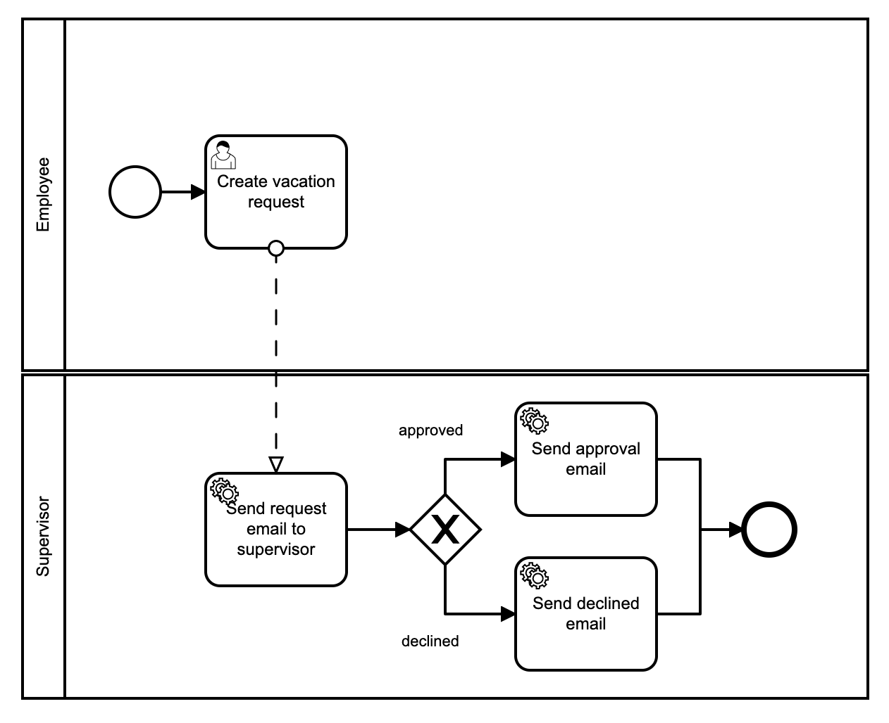
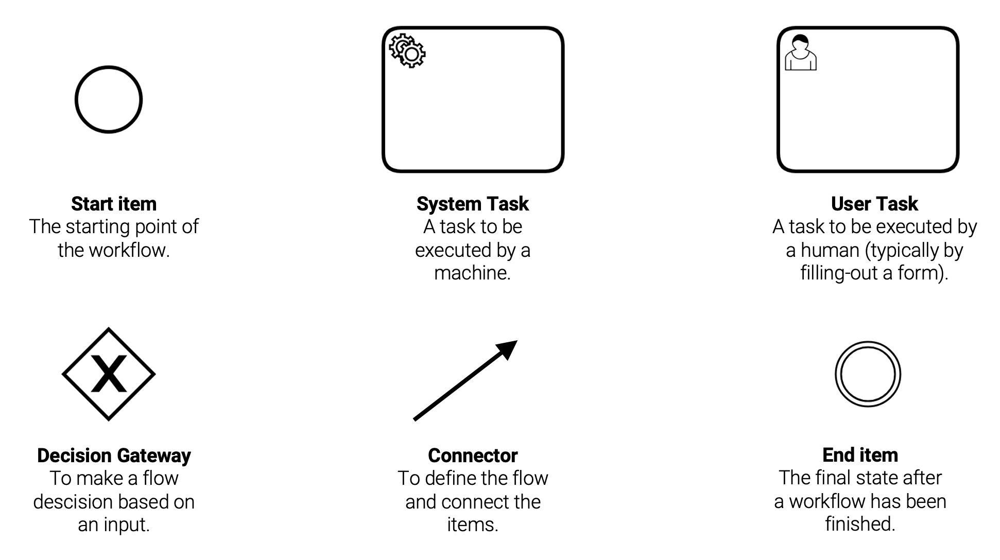
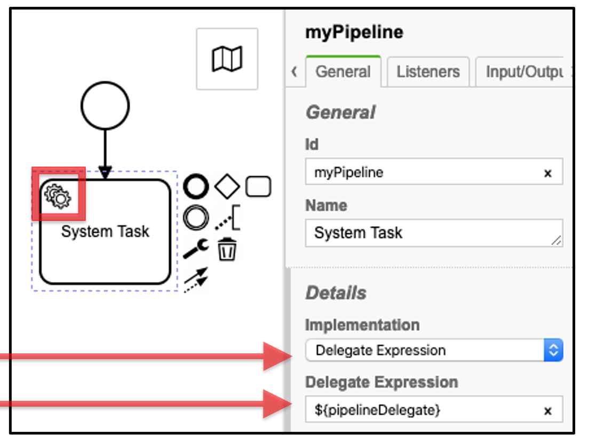
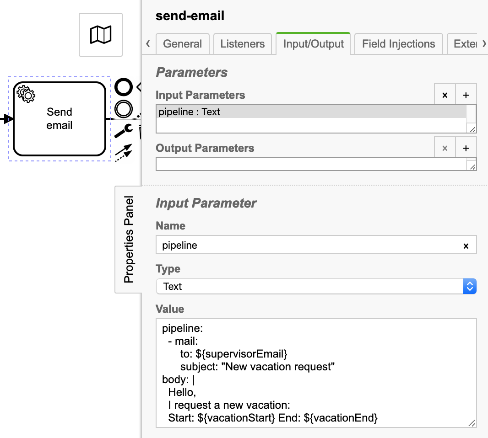
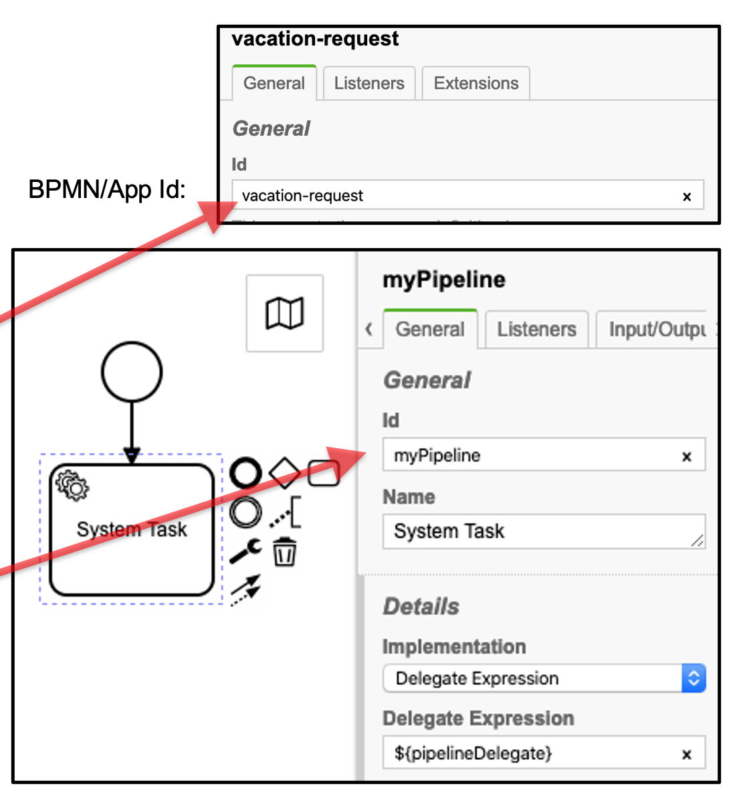

A workflow in PIPEFORCE is a stateful business process, where one or more humans are involved. Workflows can be modelled using a graphical interface and they can optionally trigger the execution of pipelines.

## Workflow design with BPMN

In PIPEFORCE, workflows can be designed using BPMN (Business Process Model and Notation), which is a worldwide ISO standardization to describe business processes in a formalized (graphical) way. Also, most non-technicals can understand BPMN diagrams. If you’re not familiar with BPMN so far, we highly recommend you to learn more about it before you dive deeper into this chapter. Here you can find a first introduction on Wikipedia: [https://en.wikipedia.org/wiki/Business\_Process\_Model\_and\_Notation](https://en.wikipedia.org/wiki/Business_Process_Model_and_Notation).

Below is a very simple example of such a BPMN diagram, which shows a vacation approval process where the employee must fill-out a request form, and the supervisor can then approve or decline the vacation request:



BPMN digrams are designed using a BPMN designer tool. You can use your own local software to design such a diagram and then upload them to PIPEFORCE, or you can use the built-in online BPMN designer from PIPEFORCE. With the latter, you can:

*   Create BPMN diagrams online in your web browser and save them
    
*   Discuss a BPMN diagram with your team
    
*   Link BPMN tasks with pipeline
    
*   Directly execute and review BPMN diagrams as workflows
    

In order to draw a BPMN diagram, the most important elements are these, that you should be aware of:



## User Task

The user task is the part of a workflow in case an input from a user is required. The workflow waits at this point until the user has finished this task by clicking “Complete”.

The input of the user is typically given by filling-out a form.

The form can be defined using the “Forms” tab in the modeller.


User tasks can also be assigned in the workflow to specific users and user groups, by using the general tab. There is an "Assignment" section below the Description field. In this section, the entries need to be entered in the following format:

Assignee: Username

Candidate User: Username

Candidate Group: Groupname


## System Task

If a task in the workflow must be executed by a “machine”, for example, sending an email, doing a conversion, or creating a new dataset, typically a System Task is used for this.

By default, a pipeline is used to execute such a system task.

To configure a system task to execute such a pipeline, you need to make sure, that you have these settings in place:

1.  The task type is set to a System Task.
    
2.  The Implementation is set to `Delegate Expression`.
    
3.  The Delegate Expression is set to `${pipelineDelegate}`.
    



To execute a pipeline, you have two configuration options:

1.  Calling a pipeline **embedded** into the User task as a parameter.
    
2.  Calling a pipeline **stored in the property store**.
    

### Call an embedded pipeline

In order to trigger an embedded pipeline whenever the system task is executed, you can define a new input parameter with the name `pipeline` of type `Text`, and add the pipeline directly as a value:



### Call a pipeline stored in the property store

Lets assume, a pipeline is stored in the property store under this key path:

```bash
global/app/vacation-request/pipeline/myPipeline
```

Then, you need to configure your System Task like this to automatically pick-up and execute this pipeline, in case the system task is executed by the workflow:

1.  Make sure the Id of the BPMN workflow has the same name as the app: `vacation-request`.
    
2.  Make sure the Id of the System Task, which should execute the pipeline, has the same name as the pipeline: `myPipeline`.
    
3.  **Do not** define any pipeline parameter in the System Task.
    

When executed, the System Task automatically searches for a pipeline in the given app folder and executes it.



## How to start a workflow in PIPEFORCE?

The design and execution of a workflow in PIPEFORCE is always a 3-steps task:

1.  **Design** the workflow in the BPMN modeler, and save the result. When you work locally with the pi tool, save it at: `app/myApp/workflow/myWorkflow.bpmn`.
    
2.  **Deploy** by pushing the **DEPLOY** button in the online designer, or upload the BPMN file using the pi tool by calling the command: `pi publish`.
    
3.  **Execute** the workflow using the command `workflow.start` in a pipeline, and set the Id of your process as the parameter key (see BPMN file). You can use, for example, the pi tool to start a workflow:  
    `pi uri ”workflow.start?key=<ID>”`
    

Then, you can login to your portal at `https://<NAMESPACE>.pipeforce.net`, and complete the workflow.
