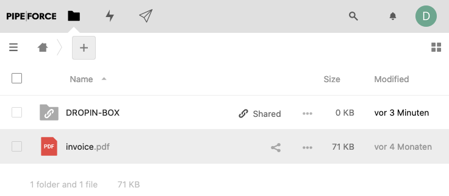
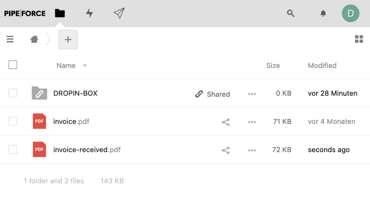
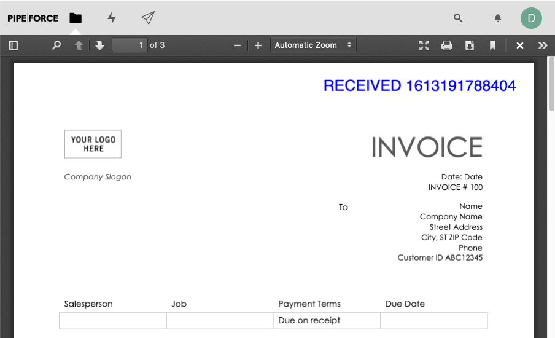
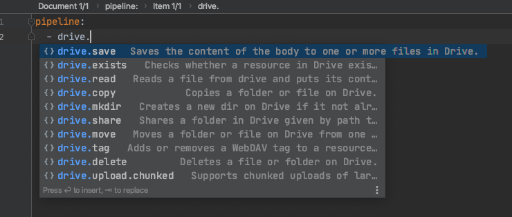

# Create your pipeline

In this step now its time for your first pipeline. Pipelines are “the heart” of your business app. With a pipeline you can connect data, workflows, systems and do much more without real coding.

In order to create your first pipeline, type-in this command in your VS Code terminal:

```bash
~/pipeforce %> pi new pipeline
```

Then follow the questions of the wizard:

*   **Select the app to apply the action to**: <Select your app `myapp42` here>
    
*   **New pipeline name**: `helloworld`
    

Finally a new demo pipeline file is created `src/global/app/myapp42/pipeline/helloworld.pi.yaml`:

```yaml
pipeline:
  - log:        
      message: "Hello World"
```

As you can see, this demo pipeline is really simple. It defines the YAML element`pipeline:` and below the command element `log` which simply logs a message `“Hello World”` at server side.

At first, lets execute this pipeline file locally without publishing it. To do so, execute this command:

```yaml
~/pipeforce %> pi pipeline file src/global/app/myapp42/pipeline/helloworld.pi.yaml
```

What happens in the background is that the command instructions of the locally stored pipeline file will be send to the server and executed there, but without storing it at server side. Then the result is sent back to the client. This is handy in case you would like to try and execute an ad-hoc task without uploading the pipeline to the server. After execution, you should see an output similar to this in your VS Code terminal:

```yaml
result:
  value: "Hello World"
```

**Congrats, you have executed your first pipeline!**

# 2 - Publish your pipeline

Now lets publish the pipeline to the server using this command:

```yaml
~/pipeforce %> pi publish
```

Once the pipeline was published to the server you can execute it now remotely:

```yaml
~/pipeforce %> pi pipeline remote global/app/myapp42/pipeline/helloworld
```

With this command the pipeline is searched, loaded and executed purely on server side.

**Important Note**  
Once a file was published to the server, it will automatically get its relative path inside of the `src` folder assigned as unique key at server side, but without any extensions of the filename. Using this key, you can refer and load the resource later on. Lets see some example mappings from local file path to key:

*   Local filename → Property key
    
*   `src/global/app/myapp42/form/myform.json` → `global/app/myapp42/form/myform`
    
*   `src/global/app/myapp42/pipeline/hello.pi.yaml` → `global/app/myapp42/pipeline/hello`
    

# 3 - Create a stamp pipeline

Lets assume you have a PDF file `invoice.pdf` stored in the root of your drive folder. To do so, open your browser and go to this url: [https://drive-NAMESPACE.pipeforce.net](https://drive-NAMESPACE.pipeforce.net) (make sure to replace NAMESPACE by your real namespace name).

Then, upload a invoice PDF file into the root of your drive and name it `invoice.pdf`:



If you do not have a sufficient PDF file at hand, you can download and use the PDF file attached here:

[invoice.pdf](/wiki/spaces/DEVEX/pages/2151286028/Tutorial%3A+Create+a+pipeline+with+CLI?preview=%2F2151286028%2F2151286056%2Finvoice.pdf)

In the next step, we gonna use a pipeline to write the text `RECEIVED <TIMESTAMP>` on this PDF. To do so, first create another pipeline using this command:

```yaml
~/piepforce %> pi new pipeline
```

When asked, select the app `myapp42`, give the pipeline the name `createstamp` and finally open the generated pipeline which contains again the helloworld log command. Remove the content of this file and replace it by the commands shown below:

```yaml
pipeline:
  - drive.read:
      path: "invoice.pdf"
  - pdf.stamp:
      text: "RECEIVED #{@date.timestamp()}"
      margin: "20"
  - drive.save:
      path: "invoice-received.pdf"
```

Your pipeline now consists of three commands:

1.  Load the PDF document from drive using the command `drive.read`.
    
2.  Put a PDF stamp on this loaded invoice using the `pdf.stamp` command.
    
3.  Store the stamped PDF document back to drive under new name `invoice-received.pdf` using the command `drive.save`.
    

Save this pipeline and execute it locally:

```yaml
~/pipeforce %> pi pipeline file src/global/app/myapp42/pipeline/createstamp.pi.yaml
```

After execution of this command, open the drive service in your browser. After a refresh of the page you should now see the additional file `invoice-received.pdf` listed there:



When you open it, you should see the generated stamp in the top right corner of the PDF:



**Tip 1:** The online documentation of all available commands can be found at [https://NAMESPACE.pipeforce.org/#/commands](https://NAMESPACE.pipeforce.org/#/commands) (replace NAMESPACE by your real namespace name) or you use the CLI:  
`pi help command`

**Tip 2:** If not already done, we highly recommend to activate the YAML plugin in your editor in order to get all available commands listed right inside your editor while typing. See the local toolings section at the beginning of this tutorial on how to do it. Or even better, use the online workbench.



**Tip 3:** If you wonder whats about the hieroglyphs displayed in your VS Code terminal after the execution of the pipeline (only on versions < 7.0): This is the content of the PDF document which is stored to drive and additionally send back to the client for further processing. This is the default behavior of a pipeline: If something is in the body, it will be send back to the client. To avoid this, you can add the command `body.delete` at the very end of the pipeline. It removes the body content before sending back a response to the client.
