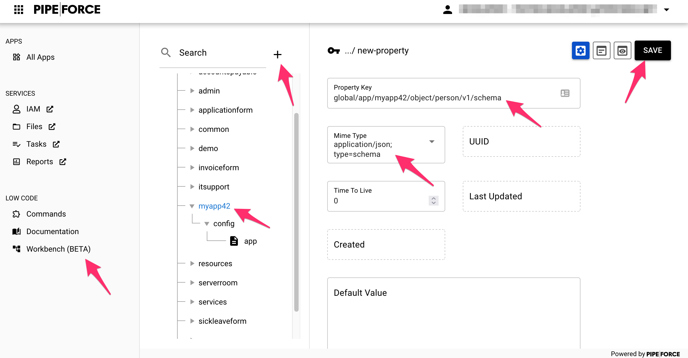
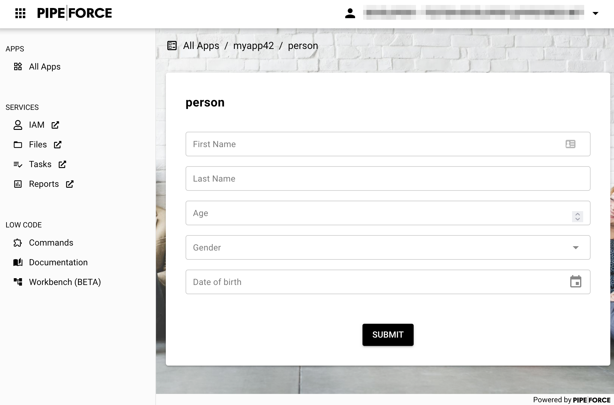

# Tutorial 3: Create a Form

**Estimated time:** 30 min.

## Prerequisites

*   PIPEFORCE Enterprise 7.0 or higher
    
*   You have a valid PIPEFORCE Developer account
    
*   You have created and published a new app (in this tutorial we assume it has the name`myapp42`).

## Intro

In this tutorial, we are going to create an example form, where you can add person datasets **using the online workbench**. This will finally look like this:


## 1 - Create your form schema

The first step is to create a form schema. The schema defines the structure of your form. In order to create this, follow these instructions:

1.  Login to your portal https://YOUR\_NAMESPACE.pipeforce.net.
    
2.  Navigate to LOW CODE → Workbench.
    
3.  Select the node of the app in the tree, inside which you would like to create the form. For example `gobal/app/myapp42`.
    
4.  Click the plus icon at the top (beside the search box).
    
5.  The **new property** view opens:
    
    1.  As a property key, use the value `global/app/MY_APP/object/person/v1/schema`. Replace `MY_APP` with the name of the app you would like to create the form inside, for example `myapp24`. **Do use only lower case letters and don’t use special characters or spaces!**
        
    2.  As mime type select `application/json; type=schema`.
        
6.  Click SAVE:  
    
    
7.  The new schema was created and pre-filled with an example person schema.
    
8.  Later, you can edit this form schema and remove, change or add data fields for your form. For this tutorial, do not change anything and leave it as it is.
    

## 2 - Create your form layout

After you have created the form schema (i.e. the structure of your form), its time to create the layout of the form (i.e. how the form should look like). To do so, follow these instructions:

1.  In the property tree, select your app and click on the plus icon to create a new property inside.
    
2.  The **new property** view opens:
    
    1.  As a property key, use the value `global/app/MY_APP/form/person`. Replace `MY_APP` with the name of the app you would like to create the form inside, for example `myapp24`. **Do use only lower case letters and don’t use special characters or spaces!**
        
    2.  As mime type select `application/json; type=form`.
        
3.  Click SAVE.
    
4.  A new form layout was created for you with a pre-configured title and configuration.
    
5.  Leave this layout configuration as it is.
    
6.  If you do not specify any layout information in here, the default layout will be used and all fields from the form schema will be displayed in vertical format.
    

## 3 - Open your new form

After the form schema and the form layout have been created, you can open your form. To do so follow these steps:

1.  Navigate to All Apps
    
2.  Click on the app you created before
    
3.  Click on person
    
4.  Now should see the form with the example fields:  
    
    

Congrats, you have created your first custom form!

## 4 - Change the layout of your form

Now we are going to change the layout of your form a bit. To do so, we add a custom layout to the form layout property. Follow these instructions:

1.  Select your form layout in the property tree, for example global/app/myapp42/form/person and switch to content edit mode.
    
2.  Replace the content of the property by the content below, and then click SAVE (Replace `myapp42` in the content below in “schema” and “output” line with the name of the app you would like to create the form for. **Do use only lower case letters and don’t use special characters or spaces!)**:
    
    ```json
    {
      "title": "Add person",
      "description": "Add a new person",
      "schema": "property.list?filter=global/app/myapp42/object/person/v1/schema",
      "output": "global/app/myapp42/object/person/v1/instance/%23%7Bvar.property.uuid%7D",
        "layout": {
          "orientation": "vertical",
          "items": [
            {
            "orientation": "horizontal",
            "items": [
              {
              "field": "firstName"
              },
              {
              "field": "lastName"
              }]
            },
            {
              "field": "age"
            },
            {
              "field": "gender"
            },
            {
              "field": "birthDate"
            }
          ]
        }
    }
    ```
    
3.  Navigate to `All Apps` and select your app
    
4.  Now you should see that the “person” tile has changed to “Add person” with some description. Click it.
    
5.  Here you can see the changed layout: `firstName` and `lastName` is now in the same line (horizontal) and all other fields are in separate lines (vertical):  
    
    
6.  You can learn more about form layouts and orientation in PIPEFORCE here: [https://logabit.atlassian.net/wiki/spaces/DEVEX/pages/1010991217](https://logabit.atlassian.net/wiki/spaces/DEVEX/pages/1010991217), and if you would like to change color or designs of the form fields, have a look here: [https://logabit.atlassian.net/wiki/spaces/DEVEX/pages/1011089441](https://logabit.atlassian.net/wiki/spaces/DEVEX/pages/1011089441). More details about the adaptation of the form schema, you will find here: [https://logabit.atlassian.net/l/c/7NdsFNrA](https://logabit.atlassian.net/l/c/7NdsFNrA)
    
7.  Try out your form, and add some new person datasets. In the next tutorial you will learn how to display them in a list.
    

:::tip 
If you have two monitors, its very handy to show the resulting form in the browser on one monitor, while editing its schema and layout in another monitor. This way you can very easily change, publish and then refresh your browser to see the changes.
:::
