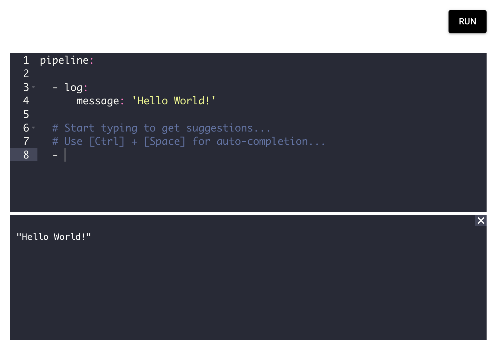
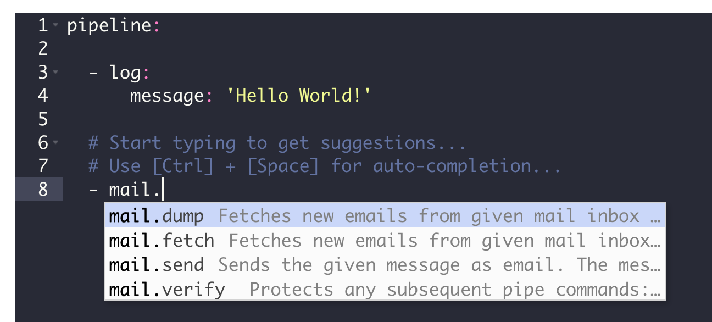
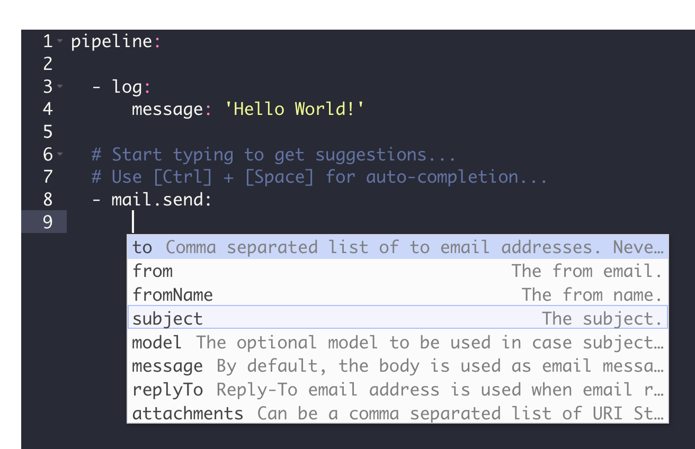
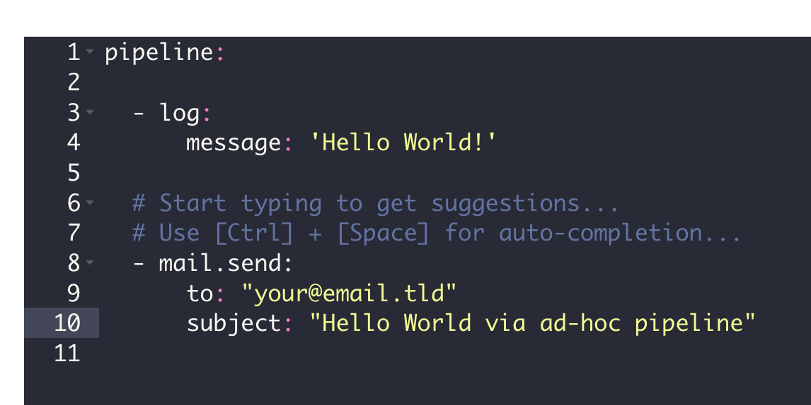
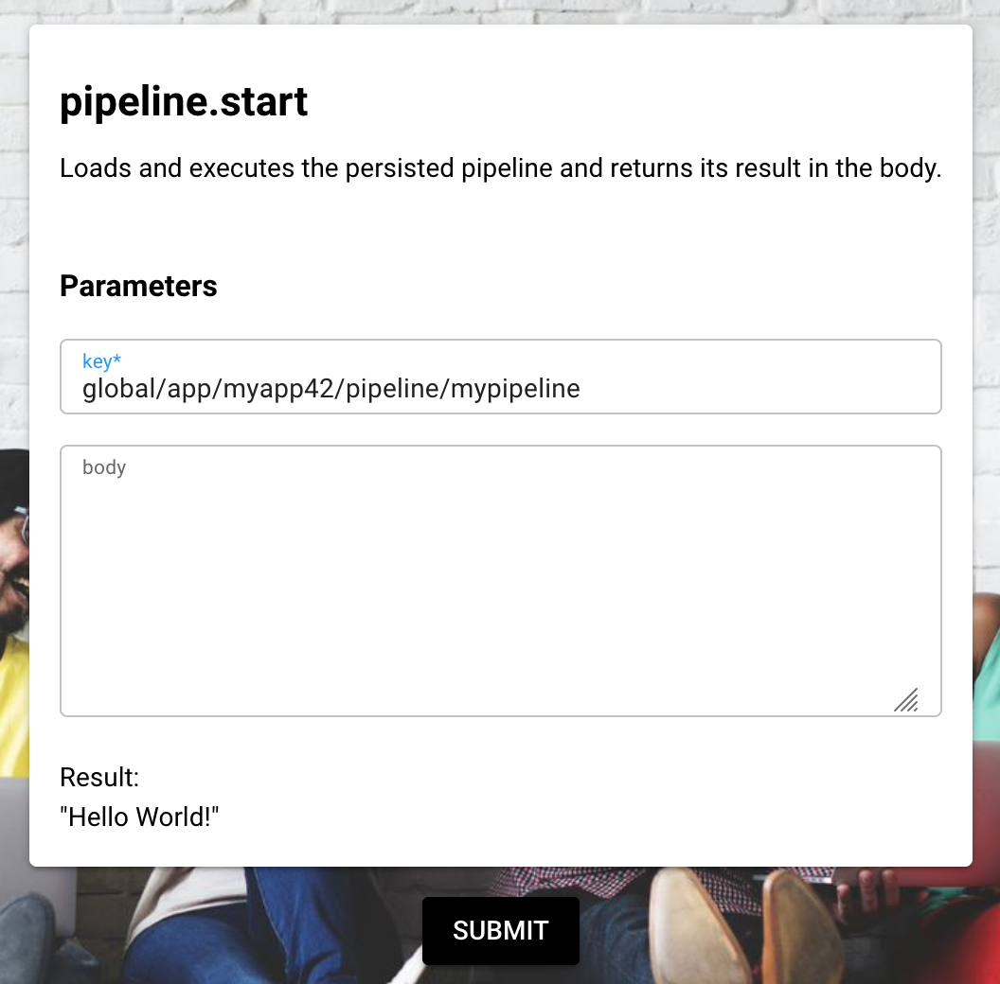

# Tutorial 5: Create a Pipeline

**Estimated time:** 20 min.

## Prerequisites

*   PIPEFORCE Enterprise 7.0 or higher
    
*   You have a valid PIPEFORCE Developer account
    
*   You have executed tutorial [Tutorial: Create a new app](../tutorials/beginner/create-app)
    

## Intro

A pipeline in PIPEFORCE is an easy to learn **low code script** which can do many different things for you:

*   Data conversion, validation and mapping
*   Connecting with external services
*   Business logic
*   Send and receive messages
*   Robotic Process Automation (RPA)
*   Regularly execute jobs
*   Trigger workflows
*   And many more…
    

It’s named “low code script”, because you are not required to do real coding inside such a pipeline script. You will mainly configure commands with parameters and combine them in a list. All commands in the list will then be executed one after the other.

Because of its simplicity and power at the same time, the pipeline is one of the most important part in PIPEFORCE. In this tutorial, you will learn how to create and execute such a pipeline script. To learn more about pipelines in detail, see this section of the documentation: [Pipelines](../guides/pipeline)

## 1 - Execute an ad-hoc pipeline

You can have two main types of pipelines:

*   **Ad-hoc pipeline**: Doesn't need to be stored. The script is sent to the server, executed and then “forgotten”. Ad-hoc pipelines are good, for example, to execute an ad-hoc query, send ad-hoc messages, or to be called by client implementations.
    
*   **Persisted pipeline**: A pipeline script which is stored at server side in the property store under a unique key. The pipeline can be executed later by calling its unique key. This kind of pipeline is good to persist your execution logic, to create automation apps and to organize them into multiple pipelines.
    

In this first part of the tutorial we gonna execute an **ad-hoc pipeline**. To do so, follow these steps:

1.  Login to the portal https://NAMESPACE.pipeforce.net

2.  Navigate to LOW CODE → Workbench
    
3.  Now you should see the ad-hoc pipeline editor automatically opened for you. It looks similar to this:  
    
    
4.  Here you can scribble any ad-hoc pipeline and execute it by pushing the RUN button.
    
5.  There is already a hello world demo pipeline prepared for you here.
    
6.  Do not change this pipeline and execute it by pushing the RUN button. After this, you should see an output like this at the bottom:  
    
    
7.  Congrats, you have executed your first pipeline!
    
8.  Next, let's create a more sophisticated pipeline by sending a simple email. To do so, start typing inside the editor after the dash `-` and you should see command suggestions like this:  
    
    
9.  Lets select the command `mail.send` from the list. Finish the line with a colon `:`, and then go to the next line and indent with two tabs `[->|]`. To see the list of available parameters for the command, press `[CTRL] + [SPACE]`, and you should again see the auto-completion list like this:
    
    
10.  Lets select the parameter `to` from the list, and set your email address and a `subject` here as shown below:
    
    
11.  In your pipeline, you have now two commands: The first one simply logs a message, while the second one sends an email. Note that each command
    
    1.  is listed below `pipeline:`,
        
    2.  is indented with one tab,
        
    3.  starts with a dash `-` followed by the command name.
        
    4.  is finished with a colon `:`.
        
    5.  can have optional parameters. In this case, you can specify them below the command after an additional indent using a tab.
        
    6.  can exchange data with other commands. If you want to learn more about this, have a look here: [https://logabit.atlassian.net/wiki/spaces/DEVEX/pages/785088596](https://logabit.atlassian.net/wiki/spaces/DEVEX/pages/785088596).
        
12.  Now, let's execute this pipeline by pressing the RUN button.
    
13.  After a while, you should receive the email in your inbox.
    
14.  Since this is an ad-hoc pipeline, when you leave this view, your pipeline is gone. Therefore, you should persist (store) it if you later need it. At first, copy this pipeline into your clipboard, then go on to the next part in this tutorial to learn how to persist it.
    

## 2 - Persist a pipeline

Persisting a pipeline means “storing” a pipeline script at server side in the property store ([https://logabit.atlassian.net/wiki/spaces/DEVEX/pages/988807265](https://logabit.atlassian.net/wiki/spaces/DEVEX/pages/988807265) ) under a unique key. From there you can then load and execute it later by this unique key. Follow these steps to create such a persisted pipeline:

1.  Select LOW CODE → Workbench.
    
2.  In the property tree select the node of the app you’ve created in the last tutorial.
    
3.  Click the plus icon at the top of the tree.
    
4.  The new property view opens:
    
    1.  As a property key, use the value `global/app/MY_APP/pipeline/mypipeline`. Replace `MY_APP` with the name of the app you created before, for example `myapp24`. **Do use only lower case letters and don’t use special characters or spaces!**
        
    2.  As mime type select `application/yaml; type=pipeline`. **Do not select** `application/json; type=pipeline`!
        
5.  Click SAVE.
    
6.  You should now see again the hello world pipeline in the editor.
    
7.  Replace the content of this editor by pasting your clipboard content here (Ctrl + V).
    
8.  Click again SAVE.
    
9.  Congrats: Now, you have your first persisted pipeline. This pipeline has the unique key `global/app/MY_APP/pipeline/mypipeline`.
    

## 3 - Execute a persisted pipeline

After you have persisted a pipeline, you can execute it by calling it using its unique property key. There are many different possibilities in PIPEFORCE to do so. In this step, you will learn how to do it using the command `pipeline.start`:

1.  Select LOW CODE → Commands.
    
2.  Search for the command `pipeline.start` and click it.
    
3.  In the parameter field `key`, copy the key of the pipeline you have created before, for example like this:  
    
    
    
4.  Execute the command by clicking **SUBMIT**.
    
5.  As a result, you should see the “Hello World” output and after a while you should have received the email in your inbox.
    
6.  Congrats, you have executed a persisted pipeline by its property key!
    

:::tip
The online documentation of all available commands for your pipelines can be found at [https://NAMESPACE.pipeforce.org/#/commands](https://NAMESPACE.pipeforce.org/#/commands) (replace NAMESPACE by your real namespace name) or you use the CLI:  
`pi help command`
:::
